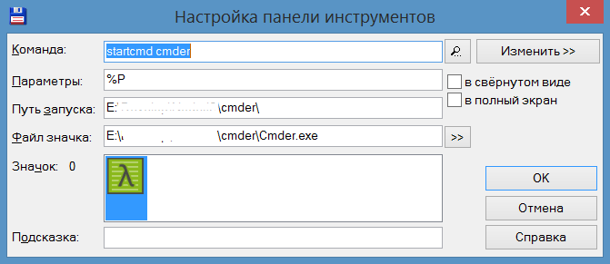

## Drive up

Hotfix for the lowercase drive letter issue on Windows OS

### Usage

first install it as a global dependency:

```shell
>npm i driveup -g
```

fix your drive letter to uppercase in the current dir:

```shell
e:\DevelopWeb\_Theming\driveup>driveup

E:\DevelopWeb\_Theming\driveup>

```

run your prefered shell:
```shell
e:\DevelopWeb\_Theming\driveup>startcmd cmder
```

it will run the [Cmder](https://github.com/cmderdev/cmder) in the current dir with uppercase drive letter

run your prefered shell in the custom dir:
```shell
e:\>startcmd cmder e:\DevelopWeb\_Theming\driveup
```

it will run the [Cmder](https://github.com/cmderdev/cmder) in the `E:\DevelopWeb\_Theming\driveup` 

for example if you're using `Total Commander` you may want to add such shortcut to launch `Cmder` from current dir:



